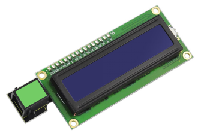
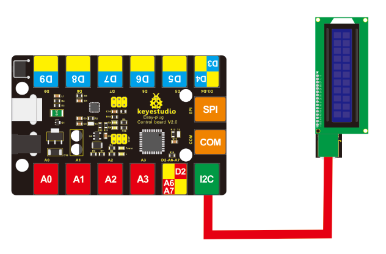
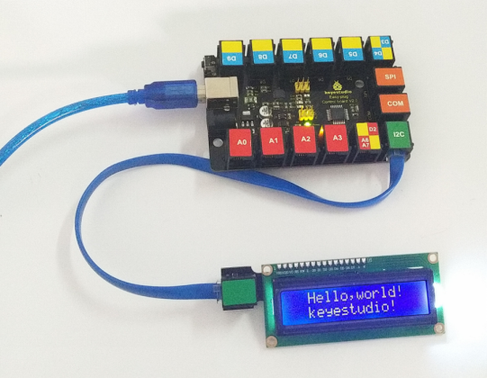

# KS0137 keyestudio EASY plug 1602 I2C Module



## 1. Introduction

This is a basic 16 character by 2 line LCD display with white text on blue background. On the back comes with a potentiometer to adjust the screen contrast. You can use only one line for simple connection.

This module should be used together with EASY plug control board.

**Special Note:**

The sensor/module is equipped with the RJ11 6P6C interface, compatible with our keyestudio EASY plug Control Board with RJ11 6P6C interface.

If you have the control board of other brands, it is also equipped with the RJ11 6P6C interface but has different internal line sequence, can’t be used compatibly with our sensor/module.

## 2. Specification

- Connector: Easy plug
- Compatible with Arduino LiquidCrystal Library
- White text on blue background
- 16 characters wide, 2 rows
- I2C Address: 0x27
- Back Light: Blue
- Text Color: White
- Supply Voltage: 5V
- Adjusting contrast by a potentiometer

## 3. Technical Details

- Dimensions: 99mm * 37mm * 21mm
- Weight: 37.4g

## 4. Connect It Up

Connect the EASY Plug 1602 LCD to control board using an RJ11 cable. Then connect the control board to your PC with a USB cable.



## 5. Upload the Code

Download Resource:   [Resource](./Resource.7z)

Note： before uploading the code, you need to import the library files; otherwise, the code upload will fail.

```c
#include<Wire.h>    // Place file “Wire.h” under the directory “library” of Arduino
#include<LiquidCrystal_I2C.h>  // Place “LiquidCrystal_I2C.h” under the directory “library” of Arduino
LiquidCrystal_I2C lcd(0x27,16,2);// set the LCD address to 0x27 for a 16 chars and 2 line display

void setup()
{
    lcd.init();// initialize the LCD
    lcd.init();// Print a message to the LCD.
    lcd.backlight();
    lcd.setCursor(2,0);
    lcd.print("Hello, world!");
    lcd.setCursor(2,1);
    lcd.print("keyestudio!");
}

void loop()
{
}
```

## 6. Result

Initially, you should see the words “hello, word!” and “keyestudio!” pop up on your LCD.

Remember you can adjust the contrast using the potentiometer on the module back if you can’t make out the words clearly.

